# Relatório Técnico — Sistema de Detecção e Segmentação de Fauna Silvestre em Rodovias

**Grupo:** _[nomes completos de todos os integrantes]_
**Disciplina:** Visão Computacional e Reconhecimento de Padrões — Prof. Romes Heriberto
**Repositório:** _[link do GitHub]_ · **Vídeo-pitch:** _[link]_

> **RASCUNHO para revisão do grupo.** Todos os números vêm das execuções registradas em `outputs/`
> (13–14/09/2026). Trechos entre _[colchetes]_ devem ser preenchidos pelo grupo. As hipóteses sobre
> erros foram escritas a partir das figuras citadas e devem ser conferidas antes da entrega.

**Declaração de uso de IA generativa.** O Claude Code (Anthropic) foi usado para: estruturar o repositório
e os templates de documentação; escrever e revisar os scripts de coleta (`00`), pré-anotação (`00b`),
preparação, treino, avaliação e inferência (`01`–`05`) e os testes; executar o pipeline localmente;
e redigir este rascunho de relatório e o roteiro do vídeo a partir dos resultados gerados.
_[Descrever o que o grupo revisou, corrigiu e decidiu — ex.: escolha do cenário e das espécies,
revisão das labels, conferência dos números e das análises de erro.]_

---

## 1. Problema e cenário

Rodovias brasileiras concentram um número muito alto de atropelamentos de fauna silvestre: estimativas
do Centro Brasileiro de Estudos em Ecologia de Estradas (CBEE/UFLA) apontam **centenas de milhões de
animais mortos por ano**, incluindo espécies ameaçadas de extinção. Além da perda de biodiversidade, a
colisão com animais de grande porte coloca motoristas em risco.

**Cenário escolhido:** Cidades Inteligentes — variante *prevenção de atropelamento de fauna silvestre*.
O objetivo é um sistema de visão computacional que **detecta e segmenta** animais silvestres em imagens e
vídeo, como base técnica para câmeras de borda que alertem motoristas em tempo real.

**Trabalho relacionado.** Um estudo do ICMC-USP publicado na *Scientific Reports* avaliou modelos YOLO
para detecção de mamíferos da fauna brasileira em rodovias, sem etapa de segmentação. Este projeto
acrescenta **segmentação de instâncias**, avaliação no teste com análise de erros e inferência em vídeo
com rastreamento.

**Classes-alvo** (espécies frequentemente atropeladas e visualmente distinguíveis entre si):

| Classe | Espécie | Justificativa |
|---|---|---|
| capivara | *Hydrochoerus hydrochaeris* | Muito atropelada; grande porte, risco ao motorista |
| cachorro_do_mato | *Cerdocyon thous* | Entre as mais atropeladas em estudos no Brasil central |
| tamandua_bandeira | *Myrmecophaga tridactyla* | Ameaçada; silhueta muito distinta (bom caso de segmentação) |
| tatu | *Euphractus sexcinctus* (tatu-peba) | Muito atropelado; carapaça com contorno definido |
| lobo_guara | *Chrysocyon brachyurus* | Ameaçada; ícone de conservação do Cerrado |

## 2. Dataset e EDA

### 2.1 Fonte e mudança em relação à proposta (Fase 1)

A proposta previa datasets do Roboflow Universe complementados por anotação manual de máscaras no CVAT.
Na prática, os datasets públicos encontrados tinham predominantemente espécies não brasileiras, e não
havia tempo para anotar manualmente centenas de polígonos. O grupo mudou a estratégia para:

1. **Imagens — iNaturalist** (`scripts/00_download_inaturalist.py`): observações *research grade*
   (espécie confirmada pela comunidade), anotação "Evidence of Presence = Organism" (exclui fezes,
   pegadas e ossos), uma foto por observação, somente licenças CC0, CC BY, CC BY-SA e CC BY-NC.
   Download em 13/09/2026: **900 fotos (180 por espécie)**. Autor, licença e link de cada imagem em
   `data/ATRIBUICAO_imagens.csv`.
2. **Labels — pseudo-labels YOLOE-26** (`scripts/00b_autolabel_yoloe.py`): o modelo open-vocabulary
   `yoloe-26l-seg` localiza o animal (caixa + máscara) a partir de prompts de texto, com confiança mínima
   0,3 e área mínima de 0,2% da imagem. **A classe vem do táxon do iNaturalist, não do modelo.**
   Fotos sem detecção confiável foram descartadas.

**As labels não foram anotadas manualmente.** _[Se houve revisão: "O grupo revisou X imagens nos mosaicos
de `outputs/autolabel/revisao_*.jpg` e corrigiu Y."]_ Essa escolha é a principal limitação do trabalho
(ver seções 5 e 7).

### 2.2 Resultado da pré-anotação

| Classe | Fotos baixadas | Com label | Descartadas | Instâncias |
|---|---|---|---|---|
| capivara | 180 | 159 | 21 | 218 |
| cachorro_do_mato | 180 | 127 | 53 | 140 |
| tamandua_bandeira | 180 | 147 | 33 | 174 |
| tatu | 180 | 162 | 18 | 182 |
| lobo_guara | 180 | 118 | 62 | 121 |
| **Total** | **900** | **713** | **187** | **835** |

Licenças das 713 imagens usadas: CC BY-NC 605, CC BY 83, CC BY-SA 14, CC0 11. Por causa das imagens
CC BY-NC, dataset e pesos só podem ser usados para fins não comerciais (adequado ao trabalho acadêmico).

O cachorro-do-mato e o lobo-guará tiveram mais descartes (53 e 62): _[hipótese a conferir nos mosaicos:
mais fotos noturnas, de armadilha fotográfica ou com o animal distante]_.

### 2.3 EDA

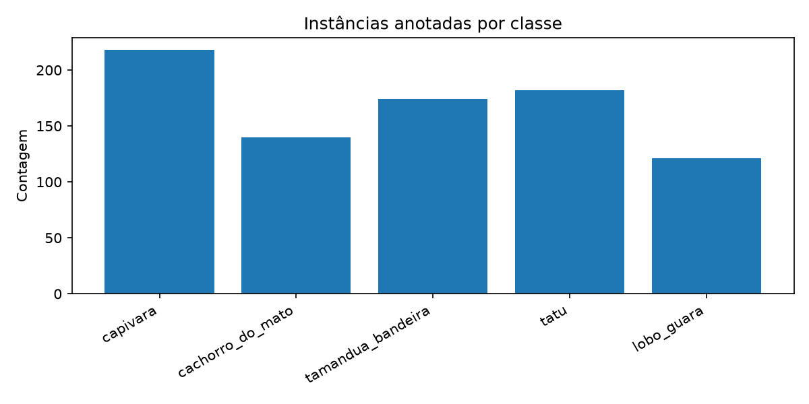

- **Desbalanceamento:** capivara tem 218 instâncias e lobo-guará 121 (razão 1,8×). A capivara também
  aparece mais vezes em grupo (1,37 instância por imagem, contra 1,03 do lobo-guará).
- **Resolução média:** 923 × 766 px (as fotos do iNaturalist chegam em tamanho "large", lado maior ≈ 1024 px).
- **Condições de luz (heurística automática, não conferida imagem a imagem):** 37 imagens (5,2%) têm brilho
  médio baixo (canal V do HSV < 60), sugerindo fotos noturnas — lobo-guará 11, cachorro-do-mato 9,
  tamanduá 8, capivara 5, tatu 4. Outras 54 (7,6%) têm saturação média < 20, típico de armadilha
  fotográfica infravermelha ou foto em preto e branco — cachorro-do-mato 19, tamanduá 14, lobo-guará 11,
  tatu 9, capivara 1. Ou seja, as espécies noturnas têm mais imagens difíceis.

### 2.4 Splits

`scripts/01_prepare_dataset.py` divide as imagens em **70/15/15 com `seed=42`** (a mesma divisão é usada
para detecção e segmentação, então o teste é idêntico nas duas tarefas).

| Instâncias | capivara | cachorro | tamanduá | tatu | lobo-guará | Imagens |
|---|---|---|---|---|---|---|
| treino | 159 | 95 | 119 | 135 | 82 | 499 |
| validação | 36 | 25 | 23 | 26 | 14 | 106 |
| teste | 23 | 20 | 32 | 21 | 25 | 108 |

**Imagens descartadas pelo Ultralytics:** 15 arquivos vieram do iNaturalist em formato **GIF com extensão
`.jpg`** (10 no treino, 1 na validação, 4 no teste). O Ultralytics os ignora como formato não suportado,
portanto não participaram do treino nem das métricas. `scripts/04_evaluate.py` aplica o mesmo filtro na
análise de erros. **Conjunto de teste efetivo: 104 imagens, 117 instâncias.**

## 3. Metodologia

### 3.1 Ambiente

MacBook Pro com Apple M3 Pro (backend **MPS**), Python 3.12.13, PyTorch 2.14.0, Ultralytics 8.4.150.
O notebook `notebooks/main_colab.ipynb` reproduz o pipeline no Google Colab (GPU CUDA).

### 3.2 Detecção

- **Modelo:** **YOLO26n** (Ultralytics), 2,5 M parâmetros, 5,9 GFLOPs, pré-treinado no COCO
  (606 de 708 tensores transferidos; a cabeça de classificação é refeita para 5 classes).
  Escolhido por ser a geração mais recente do YOLO e o tamanho *nano*, compatível com câmeras de borda.
- **Hiperparâmetros:**

| Parâmetro | Valor |
|---|---|
| Épocas / paciência (*early stopping*) | 100 / 20 |
| Tamanho de imagem / batch | 640 / 16 |
| Otimizador | automático → AdamW (lr = 0,00111, momentum 0,9, weight decay 0,0005), warmup de 3 épocas |
| Augmentation | mosaico (desligado nas 10 últimas épocas), flip horizontal 0,5, HSV (h 0,015, s 0,7, v 0,4), translação 0,1, escala 0,5, RandAugment, random erasing 0,4 |
| Reprodutibilidade | `seed=42`, `deterministic=True` |

- **Treino:** 100 épocas completas. Melhor época (fitness do Ultralytics): **88**, com validação
  P = 0,926, R = 0,775, mAP@0.5 = 0,902, mAP@0.5:0.95 = 0,801. O tempo de relógio registrado foi 13,6 h,
  mas com pausas longas entre épocas (a maior, 78 min; provável suspensão do computador); a mediana foi
  **31 s por época**.

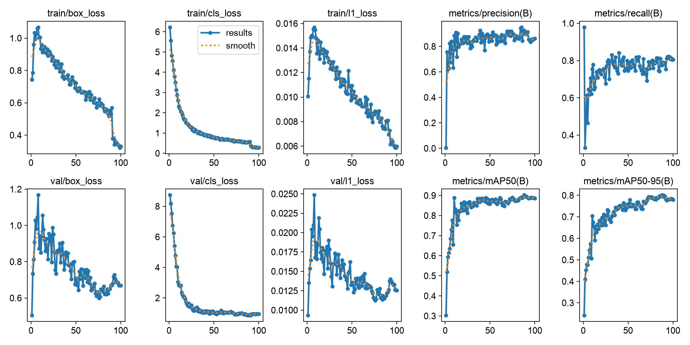

**Leitura das curvas:** as perdas de treino caem continuamente; a queda brusca da `box_loss` na época 90
coincide com o desligamento do mosaico (`close_mosaic=10`). O mAP@0.5:0.95 de validação estabiliza em
torno de 0,78–0,80 a partir da época ~75, enquanto a `val/box_loss` para de cair e sobe levemente no
final — sinal de início de sobreajuste, compatível com um dataset de 499 imagens.

### 3.3 Segmentação

- **Modelo:** **YOLO26n-seg**, 3,1 M parâmetros, 10,3 GFLOPs, pré-treinado no COCO.
- **Máscaras:** polígonos das pseudo-labels do YOLOE-26 (mesmas imagens e splits da detecção).
- **Hiperparâmetros:** idênticos aos da detecção (tabela acima).
- **Treino:** interrompido na época 28 (suspensão do computador) e retomado do checkpoint `last.pt` com
  `resume=True`. Parou por *early stopping* na época 86; **melhor época: 66**, com validação
  mAP@0.5 (máscara) = 0,913 e mAP@0.5:0.95 (máscara) = 0,750. Mediana de 39 s por época.

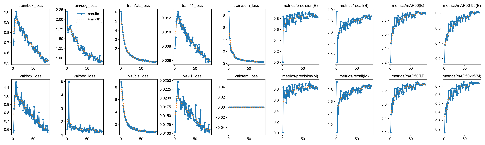

**Leitura das curvas:** a `val/seg_loss` tem um pico isolado por volta da época 5 e
depois estabiliza; o mAP das máscaras forma um platô em 0,73–0,75 a partir da época ~65, o que disparou
o *early stopping*.

### 3.4 Caixa × máscara: o que a segmentação revela

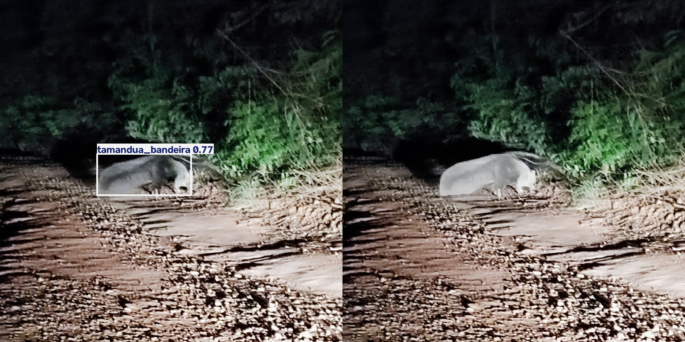
*Tamanduá-bandeira à noite em estrada de terra. Foto: © Thomaz Ricardo Favreto Sinani, CC BY (iNaturalist).*

- **Quanto da caixa é animal:** nas 121 máscaras anotadas do teste, o polígono ocupa em média **55% da área
  da caixa** (mediana 54%; 10% das instâncias ficam abaixo de 42%). Nas 129 predições do modelo de
  segmentação no teste (conf ≥ 0,25), a máscara ocupa em média **58%** da caixa. **Cerca de metade da área
  de cada caixa é fundo** (estrada, vegetação, céu).
- **Forma e postura:** no exemplo acima, a caixa inclui estrada e mato; a máscara mostra só a silhueta, o
  que permite estimar orientação (para onde o animal anda) e a área real ocupada.
- **Animais sobrepostos:** em grupos (capivaras), as caixas se sobrepõem muito; as máscaras separam os
  indivíduos, como se vê no vídeo (seção 6).
- **Aplicação:** para decidir se um animal está **sobre a pista**, a interseção da máscara com a região
  da rodovia é muito mais precisa que a da caixa, que inflaria a área em quase 2×.

## 4. Resultados no conjunto de teste

Avaliação com `scripts/04_evaluate.py` sobre as **104 imagens / 117 instâncias** do teste, nunca vistas
no treino nem na escolha da melhor época.

### 4.1 Métricas gerais

| Modelo | Saída | Precisão | Recall | mAP@0.5 | mAP@0.5:0.95 |
|---|---|---|---|---|---|
| YOLO26n (detecção) | caixas | 0,849 | 0,807 | 0,847 | 0,744 |
| YOLO26n-seg | caixas | 0,910 | 0,846 | 0,878 | 0,742 |
| YOLO26n-seg | **máscaras** | **0,910** | **0,846** | **0,875** | **0,712** |

Velocidade no teste (MPS, 640 px): detecção 5,6 ms de inferência + 1,5 ms de pós-processamento por
imagem; segmentação 7,2 ms + 4,5 ms.

### 4.2 Por classe

**Detecção (YOLO26n):**

| Classe | Imagens | Instâncias | P | R | mAP@0.5 | mAP@0.5:0.95 | IoU médio (acertos) |
|---|---|---|---|---|---|---|---|
| capivara | 16 | 22 | 0,773 | 0,636 | 0,701 | 0,599 | 0,941 |
| cachorro_do_mato | 18 | 19 | 0,787 | 0,737 | 0,844 | 0,755 | 0,924 |
| tamandua_bandeira | 25 | 31 | 0,831 | 0,793 | 0,792 | 0,690 | 0,922 |
| tatu | 20 | 20 | 0,861 | 0,950 | 0,915 | 0,794 | 0,922 |
| lobo_guara | 25 | 25 | 0,993 | 0,920 | 0,985 | 0,884 | 0,952 |

**Segmentação (YOLO26n-seg, métricas de máscara):**

| Classe | P | R | mAP@0.5 | mAP@0.5:0.95 | IoU médio das caixas (acertos) |
|---|---|---|---|---|---|
| capivara | 0,810 | 0,727 | 0,786 | 0,687 | 0,918 |
| cachorro_do_mato | 0,941 | 0,837 | 0,857 | 0,688 | 0,901 |
| tamandua_bandeira | 0,908 | 0,774 | 0,829 | 0,608 | 0,886 |
| tatu | 0,933 | 0,950 | 0,918 | 0,767 | 0,901 |
| lobo_guara | 0,959 | 0,942 | 0,985 | 0,808 | 0,932 |

O **IoU médio** é calculado entre a caixa prevista e a caixa da label, **só nos acertos** (mesma classe,
IoU ≥ 0,5, confiança ≥ 0,25); por isso é alto — ele mede o quão justas são as caixas corretas, enquanto
os erros aparecem no recall e nas contagens abaixo.

| Análise de erros (conf ≥ 0,25, IoU ≥ 0,5) | Acertos | Falsos positivos | Falsos negativos |
|---|---|---|---|
| Detecção | 95 | 22 | 22 |
| Segmentação | 101 | 28 | 16 |

### 4.3 Matrizes de confusão

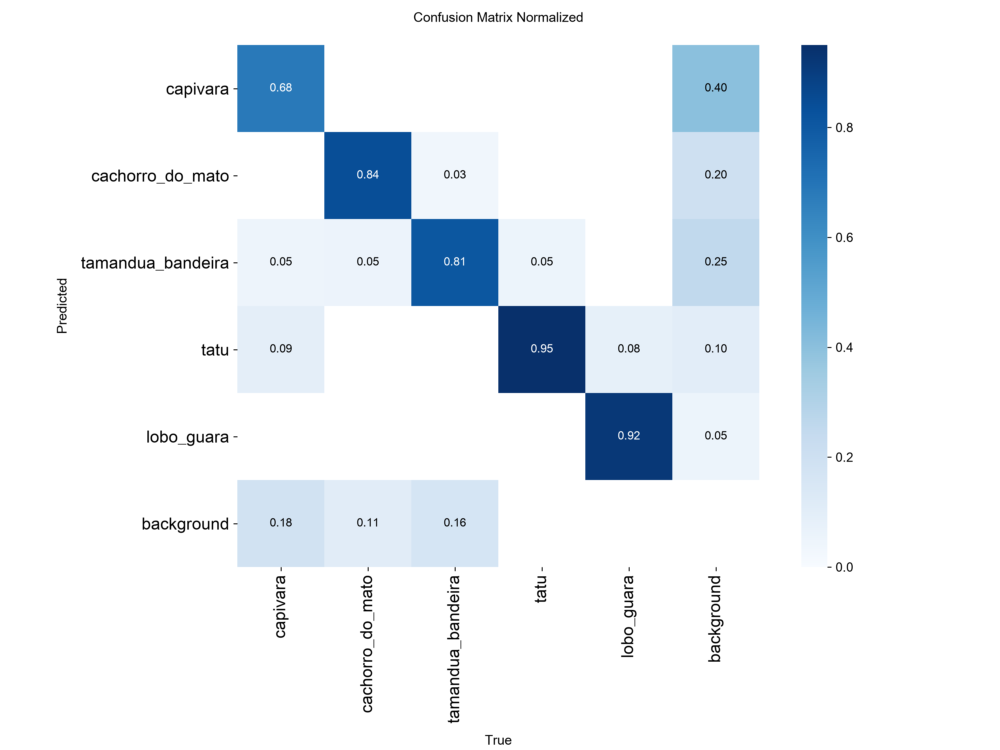
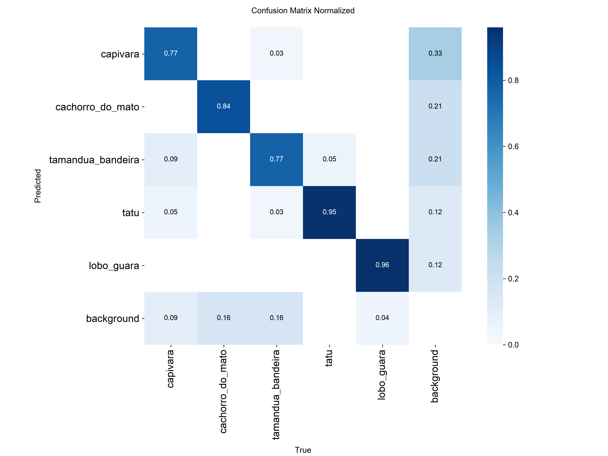

As matrizes são normalizadas por coluna (classe verdadeira). Na **detecção**, os acertos na diagonal são:
tatu 0,95, lobo-guará 0,92, cachorro-do-mato 0,84, tamanduá 0,81 e capivara 0,68. Na **segmentação**:
lobo-guará 0,96, tatu 0,95, cachorro-do-mato 0,84, capivara 0,77 e tamanduá 0,77.

**Discussão:**
- **Confusão entre espécies é rara.** Os maiores valores fora da diagonal são pequenos: na detecção,
  capivara → tatu (0,09) e lobo-guará → tatu (0,08); na segmentação, capivara → tamanduá (0,09). O erro
  dominante é **não detectar** (linha *background*): capivara 0,18, tamanduá 0,16 e cachorro-do-mato 0,11
  na detecção.
- **A capivara é a pior classe na detecção, apesar de ser a mais numerosa.** Hipóteses: é a classe com
  mais fotos em grupo e com animais parcialmente submersos ou sobrepostos, onde as pseudo-labels são
  menos consistentes (ver FN2 na seção 5).
- **"Capivara" é o rótulo mais usado nos falsos positivos:** 40% dos falsos positivos de fundo na
  detecção e 33% na segmentação. Com só 5 classes, o modelo tende a encaixar qualquer mamífero ou objeto
  marrom na classe mais frequente — o mesmo padrão aparece com urubus (seção 5) e no vídeo do lobo-guará
  (seção 6).
- **Detecção × segmentação:** no teste, o modelo de segmentação teve precisão e recall maiores que o
  detector (mesmo nas caixas), mas o mAP@0.5:0.95 das máscaras (0,712) é menor que o das caixas (0,742),
  porque exigir contornos precisos em IoU alto é mais difícil. Com 117 instâncias, **cada instância vale
  ≈ 0,9 ponto percentual de recall**, então diferenças de poucos pontos entre os modelos não devem ser
  tratadas como conclusivas.

## 5. Análise de erros

Exemplos gerados por `scripts/04_evaluate.py` (`outputs/eval/error_examples/` e
`outputs/eval_seg/error_examples/`). Nas figuras, as caixas coloridas com classe e confiança são
predições; as caixas **verdes com prefixo `FN:`** são labels não encontradas.

### 5.1 Falsos positivos

**FP1 — Dois cachorros-do-mato à noite, label com um só.**
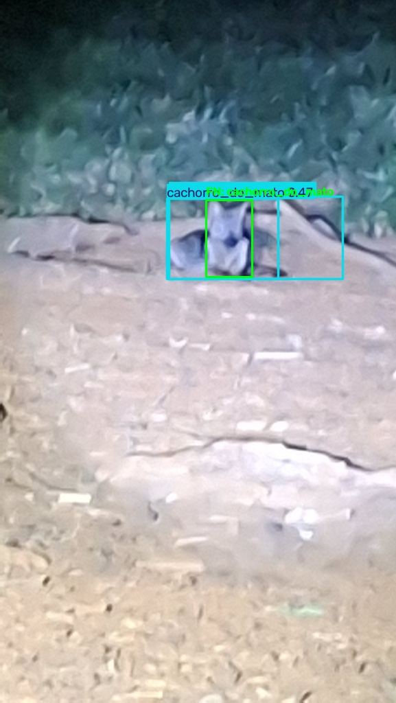
*© Maria Eduarda Pralon, CC BY-NC (iNaturalist).*
Foto noturna, borrada e com pouca luz. Há dois animais lado a lado, mas a pseudo-label marcou um
indivíduo; o modelo desenhou duas caixas sobrepostas cobrindo a dupla (uma delas com 0,47), que não
casam com a label e contam como falsos positivos. **Padrão:** baixa luz + animais sobrepostos + **pseudo-label incompleta**.

**FP2 — Lobo-guará fotografado na tela de uma câmera.**
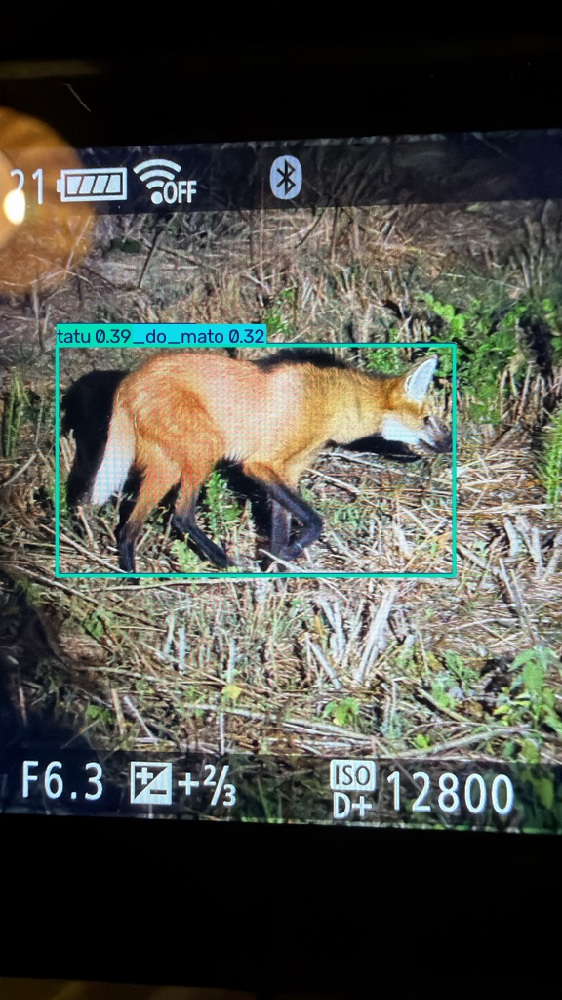
*© William Stephens, CC BY (iNaturalist).*
A foto é da tela traseira de uma câmera (ícones de bateria, ISO 12800). O modelo previu **tatu (0,39)** e
**cachorro-do-mato (0,32)** sobre o lobo-guará. **Padrão:** imagem **fora da distribuição** (moldura,
reflexo, cores alteradas), com baixa confiança nas duas predições — um limiar de confiança mais alto
eliminaria esses erros.

**FP3 — Tatu em close, caixa duplicada.**
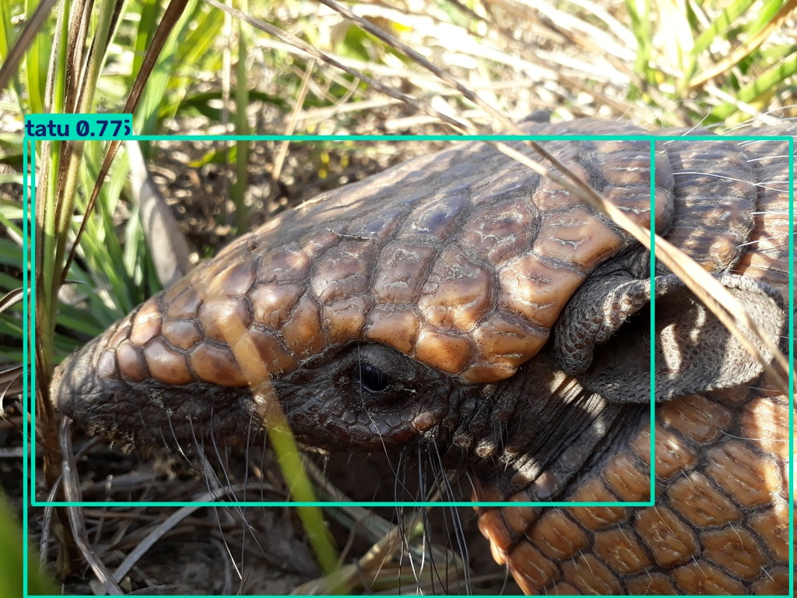
*© Tityus bahiensis, CC BY-NC (iNaturalist).*
O animal ocupa quase toda a imagem e só parte do corpo aparece. O modelo gerou duas caixas "tatu" para o
mesmo indivíduo (uma na cabeça, outra no corpo inteiro). **Padrão:** **enquadramento parcial/close-up**,
em que o modelo não tem certeza de onde o animal termina.

**FP4 (segmentação) — Urubus segmentados como capivara.**
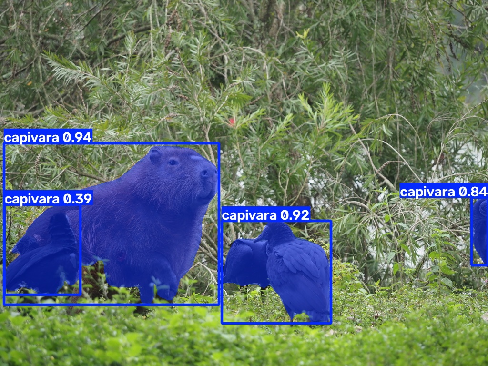
*© yongestation, CC BY (iNaturalist).*
Ao lado de uma capivara (0,94, correta), aves pretas (aparentemente urubus) foram segmentadas como
**capivara (0,92 e 0,39)**. **Padrão:** **problema de conjunto fechado** — o modelo só conhece 5 classes e
não tem exemplos negativos de outros animais, então encaixa qualquer animal numa delas.

### 5.2 Falsos negativos

**FN1 — Armadilha fotográfica: o erro é da label.**
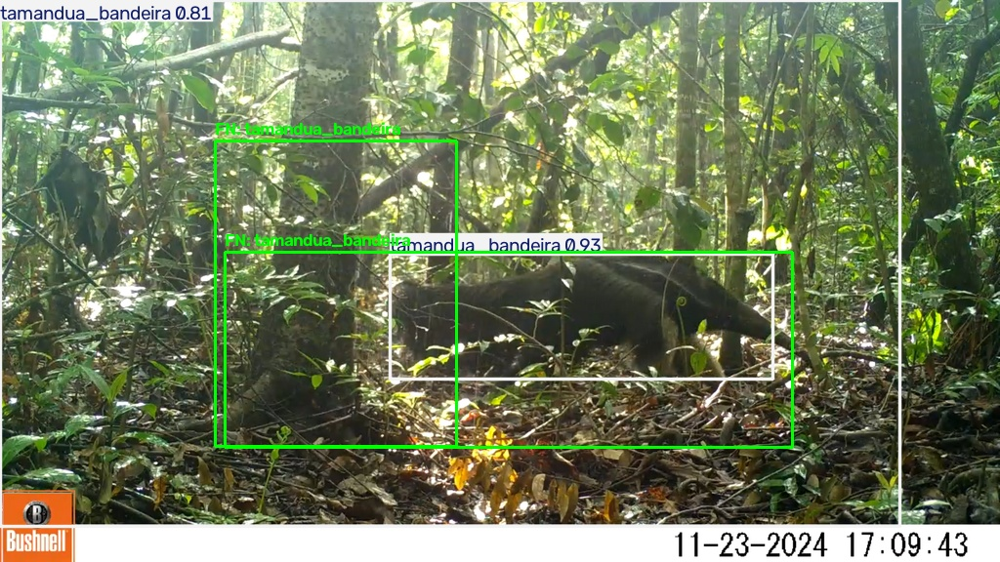
*© Matheus C. Heinzelmann, CC BY-NC (iNaturalist).*
O modelo encontrou o tamanduá com **0,93** e caixa justa. As pseudo-labels, porém, têm duas caixas
imprecisas (uma cobrindo principalmente um tronco), que não atingem IoU 0,5 com a predição e viram
"falsos negativos"; sem par, as predições (a de 0,93 e outra quase do tamanho da imagem, 0,81) contam
como falsos positivos. **Padrão:** **ruído de pseudo-label** penalizando uma predição correta.

**FN2 — Capivaras enfileiradas na água.**
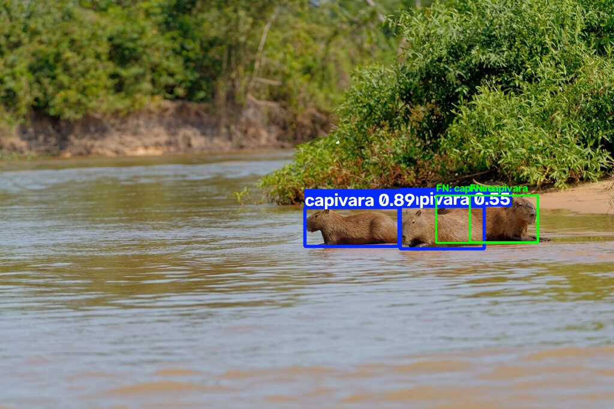
*© Nicola Marchioli, CC BY-NC (iNaturalist).*
Três capivaras atravessam o rio em fila, sobrepostas. O modelo detectou duas (0,89 e 0,55); a da direita,
parcialmente encoberta pela do meio, ficou sem detecção — e há duas labels sobrepostas nessa região. Esta foto também estava
na lista de menor confiança da pré-anotação (0,30 em `outputs/autolabel/report.json`). **Padrão:**
**sobreposição de indivíduos** + corpo parcialmente submerso.

**FN3 — Tamanduá-mãe com filhote nas costas.**
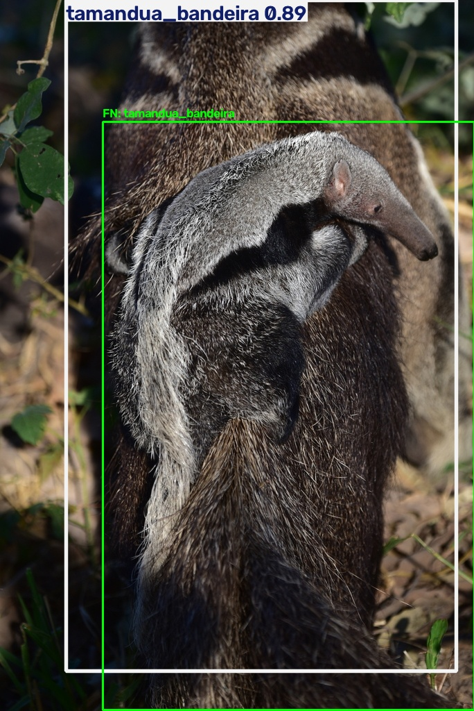
*© Lucas Leuzinger, CC BY-NC (iNaturalist).*
O modelo marcou a mãe inteira (0,89); a pseudo-label está deslocada, cobrindo o filhote e a parte
inferior do corpo, e o IoU entre as duas ficou abaixo de 0,5. **Padrão:** **ambiguidade de anotação**
(dois indivíduos fundidos) — não está claro qual deveria ser a "resposta certa".

### 5.3 Padrões observados

| Padrão | Exemplos | Consequência |
|---|---|---|
| Ruído das pseudo-labels (caixa deslocada, indivíduo faltando) | FP1, FN1, FN3 | Penaliza predições corretas; as métricas **subestimam** parte do desempenho real e o treino aprende com ruído |
| Vários indivíduos sobrepostos | FP1, FN2, FN3 | Caixas fundidas ou duplicadas; afeta principalmente capivaras |
| Imagens ou objetos fora da distribuição | FP2, FP4, vídeo do lobo-guará | Espécie errada com confiança moderada; capivara vira o rótulo "padrão" |
| Enquadramento parcial / close-up | FP3 | Caixas duplicadas no mesmo animal |
| Baixa luz / infravermelho | FP1, FN1 | Mais frequente em cachorro-do-mato, tamanduá e lobo-guará (seção 2.3) |

## 6. Aplicação em vídeo

`scripts/05_infer_video.py` com o modelo de segmentação (conf ≥ 0,3) e **rastreamento ByteTrack**
(`--track`), que atribui um identificador persistente a cada animal entre os quadros.

| Vídeo (Wikimedia Commons) | Duração | Quadros | Sem detecção | Quadros com cada classe |
|---|---|---|---|---|
| Capivaras na Fazenda San Francisco, Miranda-MS — Martin Thurnherr, CC BY-SA 4.0 | 89 s | 2.147 | 26,7% | capivara 70,9% · lobo-guará 5,4% · tamanduá 3,0% · tatu 0,2% |
| Lobo-guará no Zoológico de Ueno, Tóquio — Tokyo Zoo, CC BY 3.0 | 84 s | 2.523 | 55,6% | **capivara 35,0%** · lobo-guará 7,1% · tatu 1,2% · tamanduá 0,8% · cachorro-do-mato 0,4% |

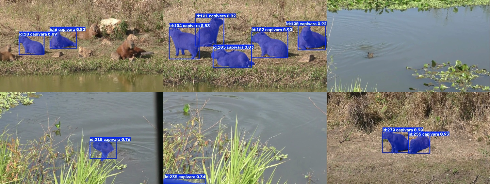

**Vídeo das capivaras (cenário de sucesso):** o sistema segmenta e rastreia o grupo, chegando a **9
capivaras num mesmo quadro**, cada uma com máscara e ID próprios. Erros visíveis: vegetação aquática
rotulada como tamanduá, detecções espúrias de lobo-guará em 5,4% dos quadros e uma capivara nadando (só a
cabeça fora d'água) não detectada. Parte dos 26,7% sem detecção corresponde a trechos sem animais e
transições do vídeo _[conferir assistindo]_.

**Diferença entre detecção quadro a quadro e rastreamento:** sem tracking, cada quadro é independente e
não é possível saber se a capivara do quadro 100 é a mesma do quadro 99. Com ByteTrack, o ID persiste
enquanto o animal é detectado, o que permitiria **contar indivíduos** e estimar trajetória e velocidade
de travessia — informações necessárias para um alerta a motoristas.

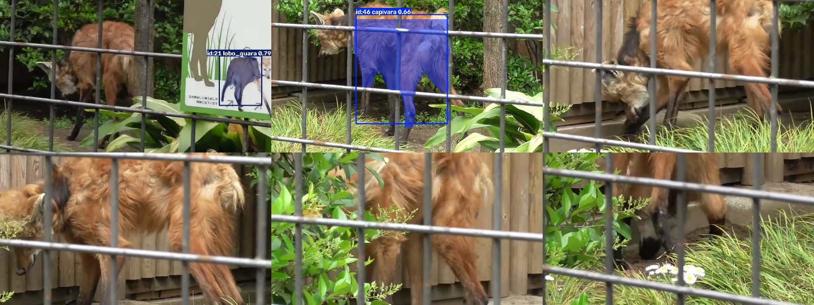

**Vídeo do lobo-guará (falha por mudança de domínio):** as máscaras seguem bem o corpo do animal, mas a
**classe está errada na maior parte do tempo**: "capivara" aparece em 35,0% dos quadros e "lobo-guará" em
só 7,1% — mesmo sendo o lobo-guará a melhor classe no teste com fotos (mAP@0.5 = 0,985). Hipóteses: grades
do recinto cortando a silhueta, animal frequentemente de costas ou com a cabeça escondida, e cenário de
zoológico ausente no treino. **Conclusão:** o desempenho no teste com fotos do iNaturalist **não garante**
desempenho em outro domínio; antes de uma aplicação real seria preciso validar com vídeos do cenário-alvo
(câmeras de rodovia).

## 7. Limitações e próximos passos

**Limitações**
1. **Pseudo-labels sem revisão manual completa:** erros do YOLOE entram no treino e na avaliação (seção 5);
   as métricas medem concordância com o YOLOE, não com anotação humana.
2. **Dataset pequeno e desbalanceado:** 713 imagens (≈ 100 a 160 por classe no treino); teste com 117
   instâncias, o que dá incerteza de alguns pontos percentuais nas métricas.
3. **Domínio das imagens:** fotos de naturalistas, em geral de perto e bem enquadradas, diferentes de uma
   câmera fixa de rodovia (distância, ângulo, noite, chuva, faróis).
4. **Conjunto fechado de classes:** sem classe "outro animal" nem exemplos negativos, o modelo rotula
   aves e outros mamíferos como uma das 5 espécies.
5. **Vídeos de teste fora do cenário-alvo:** nenhum dos dois vídeos é de rodovia; o do lobo-guará mostrou
   falha grave de classificação.
6. **15 imagens GIF** foram descartadas por formato e o treino da segmentação precisou ser retomado de
   checkpoint (seção 3.3).

**Próximos passos**
1. Revisar manualmente as labels (começando pelas de menor confiança listadas em
   `outputs/autolabel/report.json`) e reavaliar.
2. Converter as imagens GIF e incluir mais fotos noturnas, de armadilha fotográfica e de animais em grupo.
3. Adicionar imagens negativas (estradas vazias, outros animais) ou uma classe "outro animal".
4. Coletar vídeos reais de rodovia para validação e *fine-tuning* no domínio-alvo.
5. Testar modelos maiores (YOLO26s/m-seg) e ajustar o limiar de confiança por classe.
6. Exportar para formato de borda (ONNX/TensorRT/CoreML) e medir desempenho num dispositivo embarcado.

## Referências

- CBEE — Centro Brasileiro de Estudos em Ecologia de Estradas (UFLA). http://cbee.ufla.br
- Estudo do ICMC-USP sobre detecção de mamíferos brasileiros em rodovias com YOLO, *Scientific Reports*.
  _[inserir referência completa: autores, título, ano, DOI]_
- iNaturalist. https://www.inaturalist.org — atribuição de cada imagem em `data/ATRIBUICAO_imagens.csv`.
- Wikimedia Commons — *Capybaras - Wasserschweine.webm*, Martin Thurnherr, CC BY-SA 4.0; *(Inhabits South
  America) Maned Wolf (Ueno Zoological Gardens in Tokyo, Japan).webm*, Tokyo Zoo, CC BY 3.0.
- Jocher, G. et al. **Ultralytics YOLO** (YOLO26, YOLOE-26). https://github.com/ultralytics/ultralytics
- Zhang, Y. et al. **ByteTrack: Multi-Object Tracking by Associating Every Detection Box.** ECCV, 2022.
- Wang, A. et al. **YOLOE: Real-Time Seeing Anything.** arXiv:2503.07465, 2025.
